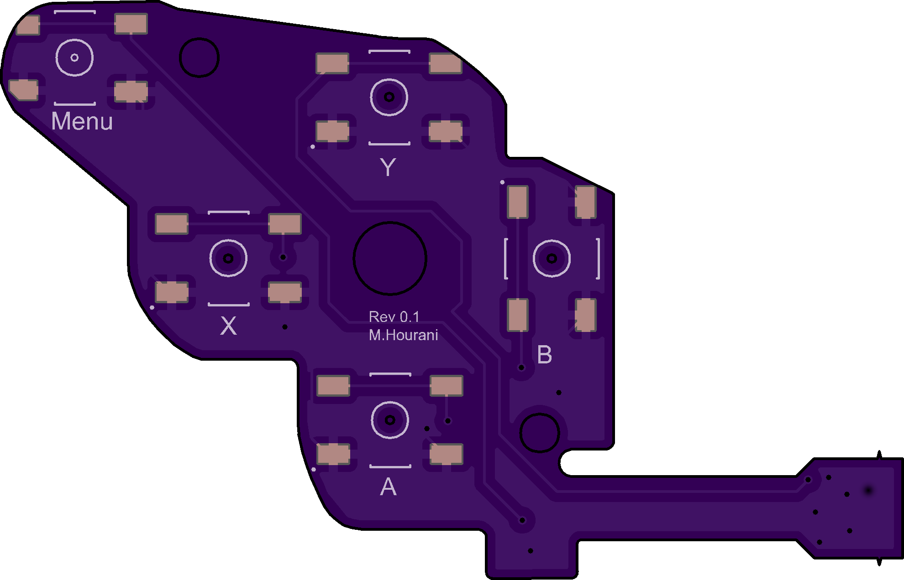
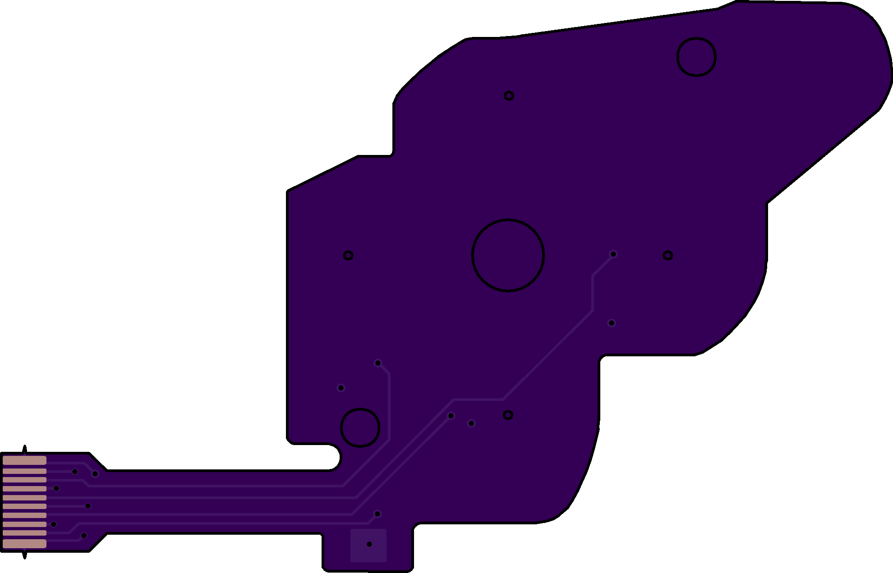

**Please Read!!!**

This project is a prototype replacement for the action button flex PCB found in the **LCD model** of the Valve Steam Deck. Important details below:

1. This is **only compatible** with the **LCD version** of the Steam Deck. It will **not fit** the OLED model.

2. There is a `User.Eco1` layer included in the design files. You must **rename this layer** to match your fabrication house’s requirements for a **stiffener layer**, so the PCB mounts properly into the flip connector on the main board.

3. This must be ordered as a **flex PCB** — rigid boards will not work.

<h3 style="color:purple;"><strong>Board Images</strong></h3>

<table>
  <tr>
    <td align="center">
       
      <b>Figure 1:</b> Action Button Flex - Front Side
    </td>
    <td align="center">
       
      <b>Figure 2:</b> Action Button Flex - Back Side
    </td>
  </tr>
</table>
